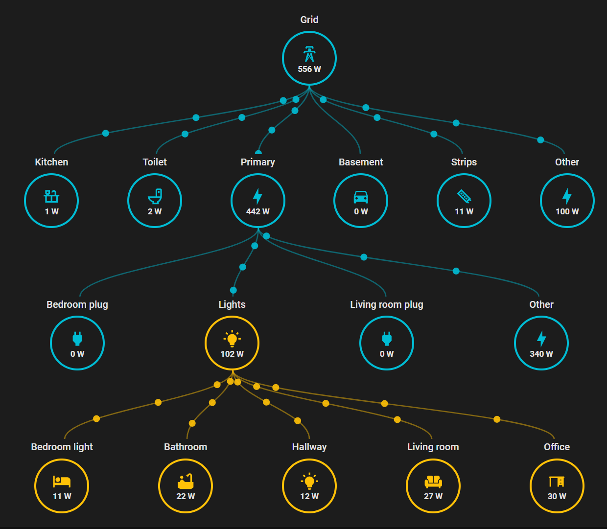

# Energy Consumption Topology

A Home Assistant Lovelace custom card that displays your energy consumption as a **tree topology** with animated power-flow bubbles.



## Features

- **Vertical or horizontal tree layout** — root at the top/left, up to 4 child layers
- **Animated bubbles** flowing along Bézier connections, speed proportional to power consumption
- **Per-node configuration** — custom name, icon, colour, and HA sensor entity
- **"Other" remainder node** — automatically calculates untracked consumption per parent
- **Responsive** — card width stretches to fit the widest layer
- **grid_options** — fine-tune card size in HA section-based dashboards
- **Validation** — clear error messages when the YAML config is invalid (duplicate IDs, missing parent, wrong layer, etc.)
- **HACS-compatible** — one-click install from the Home Assistant Community Store

---

## Installation

### HACS (recommended)

1. Open **HACS → Frontend** in your Home Assistant instance.
2. Click the **three-dot menu** (⋮) → **Custom repositories**.
3. Add the repository URL:
   ```
   https://github.com/Cycov/energy-consumption-topology
   ```
   Category: **Lovelace**.
4. Click **Install**.
5. **Refresh your browser** (hard-refresh / `Ctrl+Shift+R`).

### Manual

1. Download `energy-consumption-topology.js` from the [latest release](https://github.com/Cycov/energy-consumption-topology/releases/latest).
2. Copy the file to your Home Assistant `config/www/` directory.
3. Add the resource in **Settings → Dashboards → Resources** (or in your `configuration.yaml`):

   ```yaml
   lovelace:
     resources:
       - url: /local/energy-consumption-topology.js
         type: module
   ```

4. Restart Home Assistant and **hard-refresh** your browser.

---

## Configuration

Add the card to a dashboard view:

```yaml
type: custom:energy-consumption-topology

layout: vertical          # "vertical" (default) or "horizontal"

bubbles:
  min-speed:
    power-equivalent: 100W
    value: 10%
  max-speed:
    power-equivalent: 5000W
    value: 100%

nodes:                     # optional, node appearance
  sizes:
    circle: 64             # circle diameter in px (default: 64)
    icon: 22               # icon size in px (default: 22)
    font: 0.68             # power label font size in em (default: 0.68)

grid_options:              # optional, for HA section-based dashboards
  rows: 5
  columns: 12

root:
  id: grid
  entity: sensor.shellyabcdef01_pm_0
  name: Grid
  color: red
  icon: mdi:transmission-tower

layer0:
  - entity: sensor.shellyabcdef01_pm_1
    id: primary-rail
    parent: grid
    name: Primary
    color: blue
    icon: mdi:lightning-bolt
  - entity: sensor.shellyabcdef02_pm_0
    id: kitchen
    parent: grid
    name: Kitchen
  - entity: sensor.shellyabcdef02_pm_1
    id: toilet
    parent: grid
    name: Toilet
  - entity: sensor.shellyabcdef03_pm_0
    id: basement
    parent: grid
    name: Basement
  - entity: sensor.shellyabcdef03_pm_1
    id: light-strips
    parent: grid
    name: Strips

layer1:
  - entity: sensor.helper_ligh_sum
    id: lights
    parent: primary-rail
    name: Lights

layer2:
  - entity: sensor.shellyabcdef01_prodimmer_0
    id: light1
    parent: lights
    name: Bedroom light
  - entity: sensor.shellyabcdef01_prodimmer_1
    id: light2
    parent: lights
    name: Some light 2
  - id: lights_other
    parent: lights
    name: Untracked lights
    type: other
```

### Node options

| Option   | Required | Default                          | Description                                   |
|----------|----------|----------------------------------|-----------------------------------------------|
| `id`     | **yes**  | —                                | Unique identifier (must not be duplicated)     |
| `entity` | **yes**  | —                                | Home Assistant `sensor.*` entity ID            |
| `parent` | **yes*** | —                                | `id` of a node **in the previous layer** (or root for layer0) |
| `name`   | no       | entity name without `sensor.`    | Display label above the node circle           |
| `icon`   | no       | `mdi:lightning-bolt`             | MDI icon shown inside the circle              |
| `color`  | no       | assigned in order from palette   | Circle border & bubble colour (cycles through 12 built-in colours) |
| `type`   | no       | —                                | `"light"` — auto-switch between `mdi:lightbulb-on` / `mdi:lightbulb` based on power.  `"other"` — see below. |

\* `parent` is not used on the `root` node.  
\* `entity` is not required when `type` is `"other"`.

### The `other` node type

A node with `type: other` does **not** require an `entity`. Its power value is computed automatically as:

$$P_{\text{other}} = P_{\text{parent}} - \sum P_{\text{siblings}}$$

This is useful to show "untracked" or "unmeasured" consumption that makes up the difference between a parent's total and the sum of the individually measured children.

**Rules:**

- Only **one** `other` node is allowed **per parent**. Multiple `other` nodes under different parents in the same layer are fine.
- The node does **not** need `entity` but must still have a unique `id` and a `parent`.
- Default icon is `mdi:dots-horizontal`; default name is "Other".

### Node options — sizes

All node-sizing settings live under the `nodes:` key.

```yaml
nodes:
  sizes:
    circle: 64            # circle diameter in px (default: 64)
    icon: 22              # icon size in px (default: 22)
    font: 0.68            # power label font size in em (default: 0.68)
```

| Path                  | Default | Description                            |
|-----------------------|---------|----------------------------------------|
| `nodes.sizes.circle`  | `64`    | Diameter of the node circle in pixels. |
| `nodes.sizes.icon`    | `22`    | Size of the MDI icon inside the circle in pixels. |
| `nodes.sizes.font`    | `0.68`  | Font size of the power label inside the circle in `em` units. |

### Layout options

| Option   | Default    | Description                                      |
|----------|------------|--------------------------------------------------|
| `layout` | `vertical` | `"vertical"` — root on top, layers below.  `"horizontal"` — root on left, layers to the right. |

### Grid options (section-based dashboards)

When using HA's section-based layout, you can fine-tune the card size:

```yaml
grid_options:
  rows: 5
  columns: 12
  min_rows: 3
  min_columns: 6
```

| Option        | Default     | Description          |
|---------------|-------------|----------------------|
| `rows`        | `5`         | Card height in grid rows. The card **always fills** the allocated height — nodes and connectors stretch to use all available vertical (or horizontal) space. If there is not enough room, elements may overlap; adjust `rows` or `nodes.sizes.circle` accordingly. |
| `columns`     | `12`        | Card width in grid columns |
| `min_rows`    | = `rows`    | Minimum height       |
| `min_columns` | = `columns` | Minimum width        |

### Bubble options

All bubble settings live under the `bubbles:` key.

```yaml
bubbles:
  color: inherit          # "inherit" (default) = parent node colour, or any CSS colour
  size: 4                 # bubble radius in pixels (default: 4)
  quantity: 3             # number of bubbles per connector (default: 3)
  speed: 1                # animation duration in seconds at 100% speed (default: 1)
  min-speed:
    power-equivalent: 100W
    value: 10%
  max-speed:
    power-equivalent: 5000W
    value: 100%
```

| Path                              | Default   | Description                                                          |
|-----------------------------------|-----------|----------------------------------------------------------------------|
| `bubbles.color`                   | `inherit` | Bubble fill colour. `"inherit"` uses the parent node's colour; any valid CSS colour otherwise. |
| `bubbles.size`                    | `4`       | Bubble radius in pixels.                                             |
| `bubbles.quantity`                | `3`       | Number of animated bubbles per connector line.                       |
| `bubbles.speed`                   | `1`       | Base animation duration (seconds) at 100% speed. Lower = faster. The actual duration for a connector is `speed / speed_factor`, so bubbles slow down inversely with power. |
| `bubbles.min-speed.power-equivalent` | `100W`  | Power value that maps to the slowest bubble speed.                   |
| `bubbles.min-speed.value`         | `10%`     | Minimum animation speed (percentage of fastest).                     |
| `bubbles.max-speed.power-equivalent` | `5000W` | Power value that maps to the fastest bubble speed.                   |
| `bubbles.max-speed.value`         | `100%`    | Maximum animation speed.                                             |

> **Speed mapping:** the speed factor is linearly interpolated between `min-speed` and `max-speed`. The animation duration is then calculated as `speed / factor`, giving a **true inverse relationship** — a connector carrying 10× more power moves 10× faster.

### Validation rules

The card shows an error banner if any of the following are violated:

- `id` is missing or duplicated across all layers
- `entity` is missing on any node
- `parent` is missing on any non-root node
- `parent` references an `id` that does **not** exist in the immediately preceding layer
- Only **one** `other` node per parent is allowed (but multiple parents can each have one)
- A maximum of **4 child layers** (`layer0` – `layer3`) is supported; extra keys are ignored
- Empty layers do not contribute to card height

---

## Layers

The topology supports up to **5 levels** total:

| Level  | Key      | Description          |
|--------|----------|----------------------|
| Root   | `root`   | Single top-level node (e.g. Grid) |
| Layer 0 | `layer0` | Direct children of root |
| Layer 1 | `layer1` | Children of layer0 nodes |
| Layer 2 | `layer2` | Children of layer1 nodes |
| Layer 3 | `layer3` | Children of layer2 nodes |

Empty layers are simply skipped in the visual output.

---

## Development

```bash
# Clone & install
git clone https://github.com/Cycov/energy-consumption-topology.git
cd energy-consumption-topology
npm install

# Dev build (watch mode)
npm run watch

# Production build
npm run build
```

The built file is placed in `dist/energy-consumption-topology.js`.

Open `demo.html` in a browser to preview the card with hard-coded fake sensor data - no Home Assistant instance required.

---

## License

MIT © 2026
